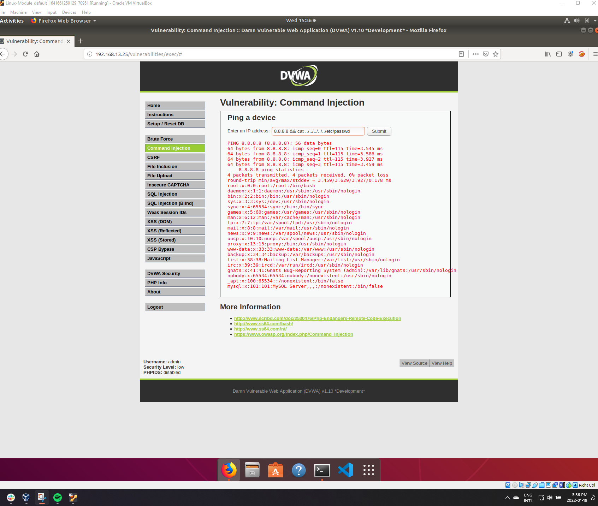
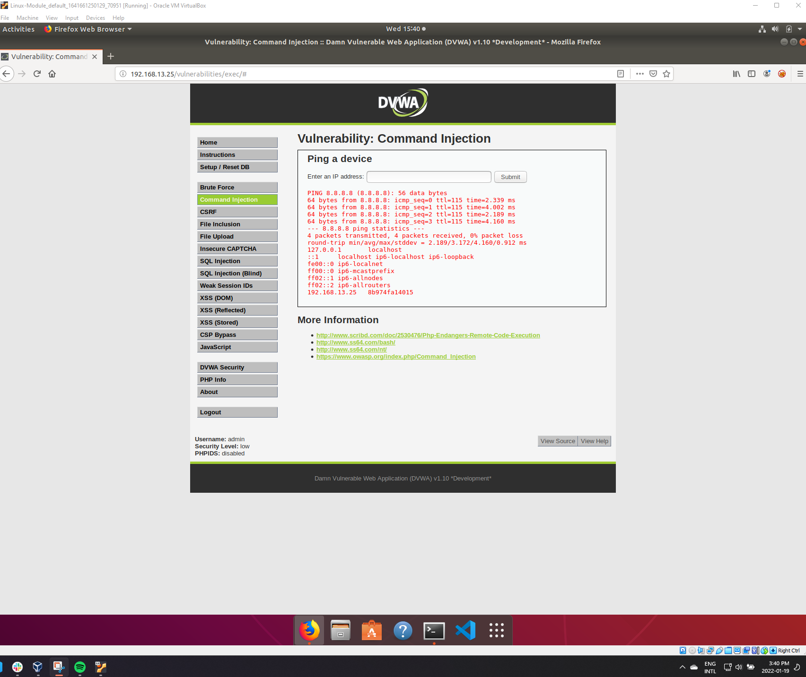
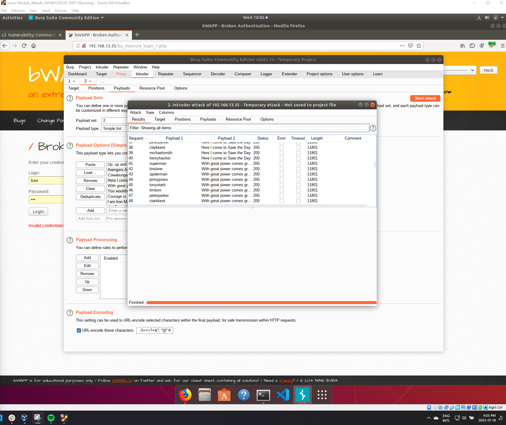
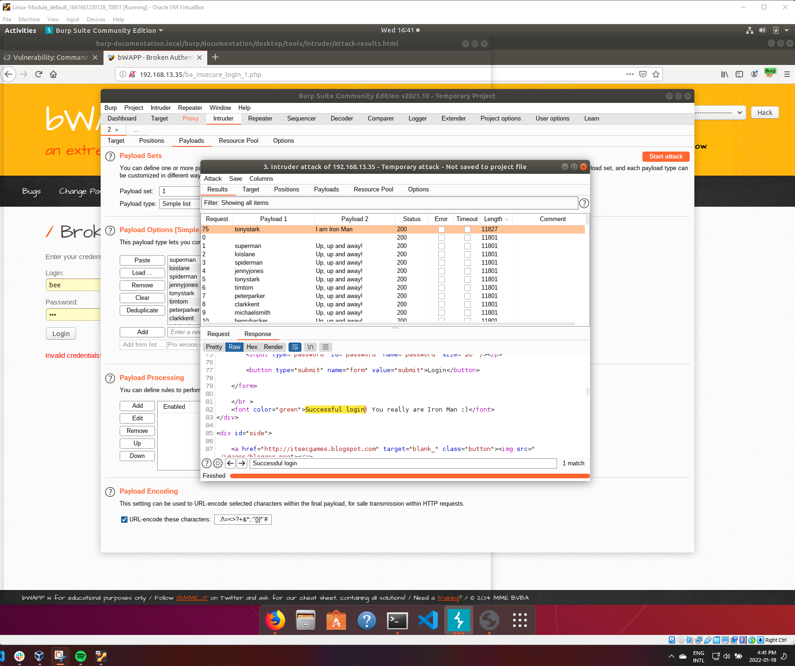
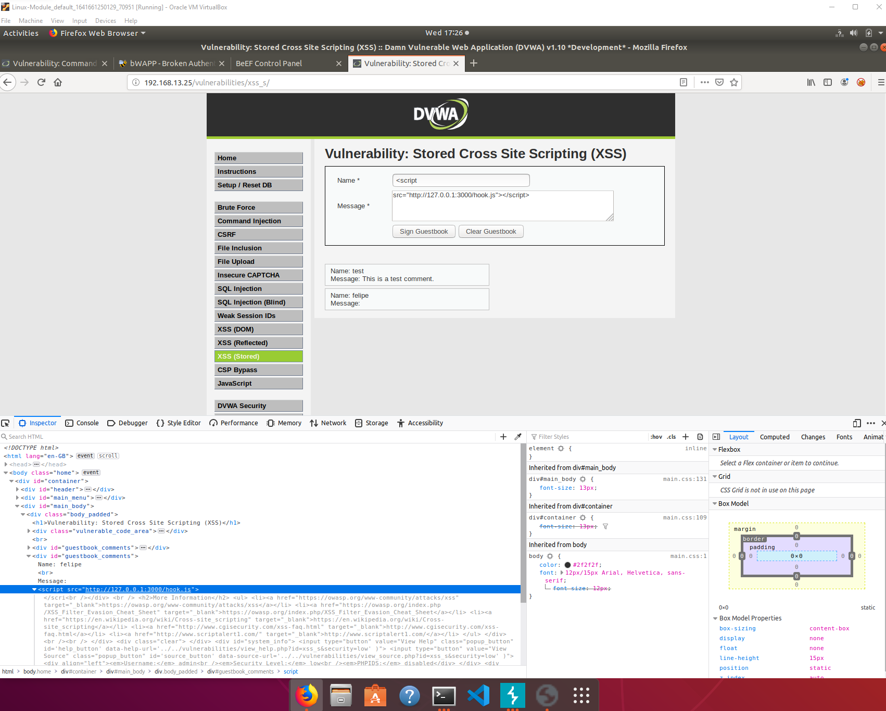
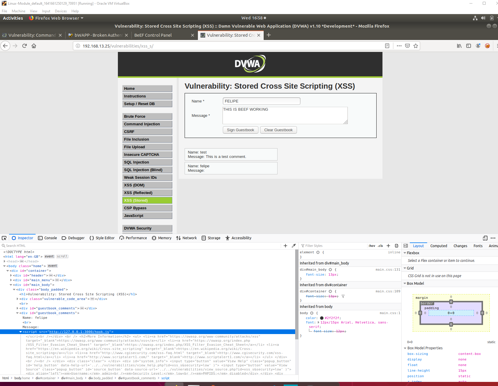
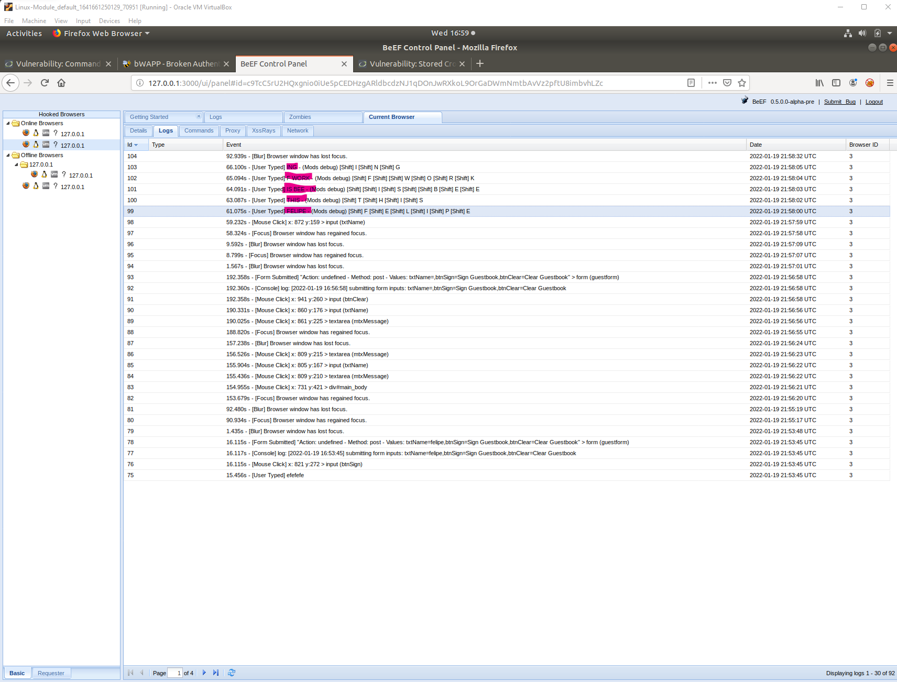

# Unit 15 Homework
 
- Web application vulnerability assessments
- Injection
- Brute force attacks
- Broken authentication
- Burp Suite
- Web proxies
- Directory traversal
- Dot dot slash attacks
- Beef
- Cross-site scripting
- Malicious payloads

## Web Application 1: Your Wish is My Command Injection

### /etc/passwd

---

### /etc/hosts

---

## Mitigations:

- Limiting user input when calling for files from the web application.

- If the application does require user input when calling for files, using **input validation** to limit the user's ability to modify the file being accessed.

- Web servers should run under a special service user account that only has access to that web folder. Apache typically uses the `www-data` account.

## Web Application 2: A Brute Force to Be Reckoned With

### Execution of attack

---

### Successfull Login

---

## Mitigations:

- Sniffing attacks:
  
  - Encrypting all incoming and outgoing communications before exchanging them over a virtual private network (VPN).

  - The web developer of the application can use an HTTP header to have a Secure cookie attribute. This ensures that the client only sends the session cookie encrypted and cannot be exposed in the web traffic.

- Client-side attacks:
  -  The web developer of the application can use an HTTP header to have an HttpOnly cookie attribute. This ensures that the client does not allow scripts, such as JavaScript, to access the session cookie. This can protect against a cross-site scripting attack trying to steal a cookie.

- Predictable sessions: the web developer of the application can prevent the session cookie being generated from being predicted or brute forced, by ensuring the following:

    - The cookie is long enough to make it difficult to brute force.

    - The cookie is random enough to be unpredictable.

    - The cookie doesn't contain any details about the user.

---

---

## Web Application 3: Where's the BeEF?

### Payload Input

---

### Execution of attack

---

### Successfull Login

## Mitigations:

- Adding a server-side input validation to deny malicious scripts as inputs.

- Using HTTP response headers that can prevent malicious scripts from running.

- Additionally, you can refer to the following resource for a comprehensive list of methods to protect applications from XSS: OWASP: Cross Site Scripting Prevention Cheat Sheet.